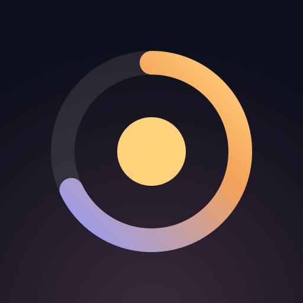
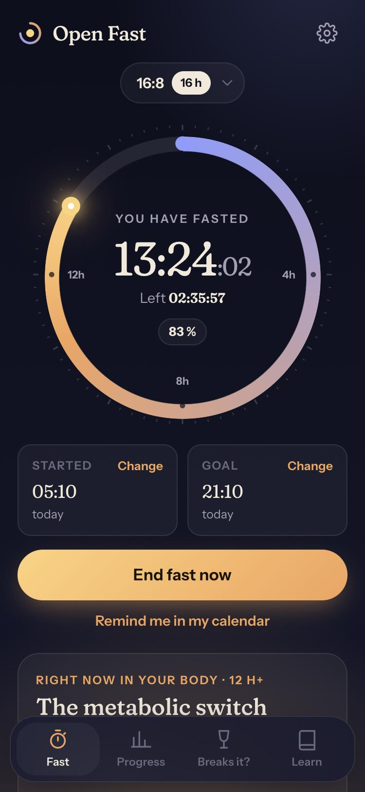
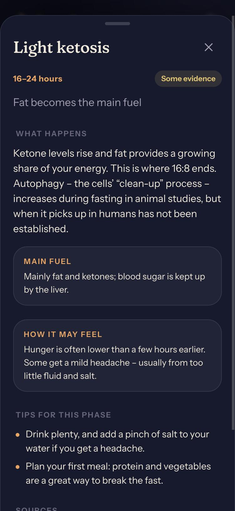
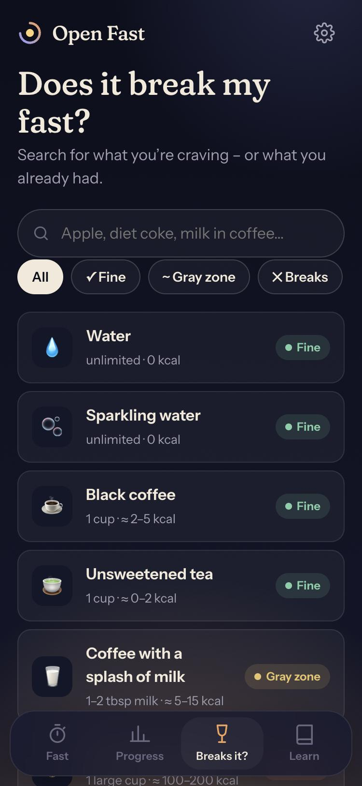
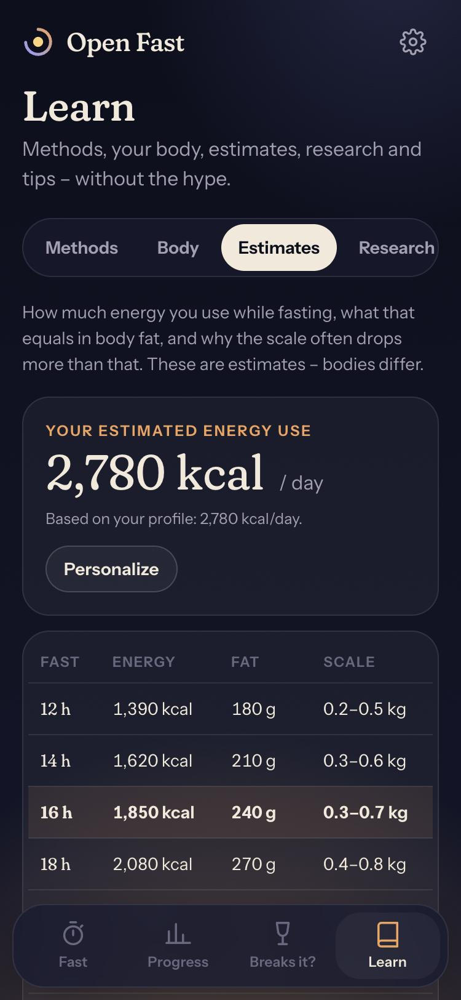

<div align="center">



# Open Fast

**An honest, beautiful intermittent fasting app. Free, open source and private by design.**

Track your fast, see what happens in your body hour by hour, check whether that apple breaks your fast,<br />
and learn what the research actually says – in English and Swedish.

[Getting started](docs/getting-started.md) · [Deploy to web, iOS & Android](docs/deployment.md) · [Architecture](docs/architecture.md) · [Content & translations](docs/content-and-translations.md) · [Science & sources](docs/science.md)

</div>

<p align="center">
  
  
  
  
</p>

## Why Open Fast?

Most fasting apps are subscription funnels full of made-up numbers ("autophagy starts at 16 hours!"). Open Fast is the opposite:

- **No account, no server, no tracking.** Everything is stored on your device. Export/import as JSON whenever you like.
- **Honest content.** Every research figure links to its source and was checked against the original paper. Where science doesn't know, the app says so.
- **Built for the phone.** Installable as a PWA, works offline, and ships as a native iOS/Android app through Capacitor.

## Features

|                                  |                                                                                                                                                                                             |
| -------------------------------- | ------------------------------------------------------------------------------------------------------------------------------------------------------------------------------------------- |
| ⏱ **Fasting timer**              | Dial from "night" to "dawn", time fasted, time left, % of goal and overtime.                                                                                                                |
| ↩️ **Start after the fact**      | Forgot to start? Pick "2 h ago" or an exact time. Edit the start during a fast and the end when you stop.                                                                                   |
| 🧭 **12 methods**                | 12:12, 14:10, 16:8, 18:6, 20:4, OMAD, 5:2, Eat-Stop-Eat, ADF, 36/48/72 h and a custom goal – with level, how-to and warnings.                                                               |
| 🫀 **9 body phases**             | From digestion to prolonged fasting. Each phase has a full "read more": what happens, main fuel, how it may feel, tips, evidence level and sources.                                         |
| 🍎 **Does it break my fast?**    | 39 foods, drinks and supplements with kcal, impact on insulin/ketosis/autophagy, what happens and what to do. Searchable in both languages.                                                 |
| 🔥 **Energy & weight estimates** | Energy used during the fast, fat equivalent and typical scale change – personalized with an optional profile (Mifflin–St Jeor). Plus a deficit calculator for expected loss per week/month. |
| 📊 **Progress**                  | Streaks, averages, longest fast, goal rate, hours per day (7/30 days), weight log with chart, editable history with undo.                                                                   |
| 📚 **Research**                  | 19 verified findings on weight, health, the body, popularity and caveats.                                                                                                                   |
| 🛟 **Safety first**              | Onboarding disclaimer, who shouldn't fast, stop signs, eating-disorder resources.                                                                                                           |
| 🌍 **English & Swedish**         | Automatic language detection, switchable in settings. kg/cm or lb/in. Light & dark theme.                                                                                                   |
| 🔔 **Reminders**                 | Goal notification (native apps schedule real notifications) and a calendar (.ics) reminder.                                                                                                 |

## Quick start

```bash
git clone https://github.com/pontushenriksson/open-fast.git
cd open-fast
npm install
npm run dev
```

Open the URL Vite prints. The dev server listens on your network too, so you can open it on your phone (same Wi-Fi) using the `Network:` address.

| Script                            | What it does                                                   |
| --------------------------------- | -------------------------------------------------------------- |
| `npm run dev`                     | Start the dev server with hot reload                           |
| `npm run build`                   | Type-check and build the production PWA into `dist/`           |
| `npm run preview`                 | Serve the production build locally                             |
| `npm run check`                   | Type-check, lint, format check and unit tests – the same as CI |
| `npm test`                        | Run unit tests (Vitest)                                        |
| `npm run format`                  | Format everything with Prettier                                |
| `npm run icons`                   | Regenerate PNG icons from `public/icon.svg`                    |
| `npm run cap:ios` / `cap:android` | Build, sync and open the native project                        |

More detail: **[docs/getting-started.md](docs/getting-started.md)**.

## Ship it

- **Web / PWA** – `npm run build` and upload `dist/` to any static host (Vercel, Netlify, Cloudflare Pages, GitHub Pages…). Users install it from the browser.
- **iOS & Android** – native apps via [Capacitor](https://capacitorjs.com), with real scheduled notifications.

Step-by-step guides for every target: **[docs/deployment.md](docs/deployment.md)**.

## Tech stack

React 19 · TypeScript · Vite · vite-plugin-pwa (Workbox) · Capacitor 8 · Vitest · ESLint · Prettier. No UI framework, no state library, no router – the app is small enough not to need them. See **[docs/architecture.md](docs/architecture.md)**.

```
src/
├── content/      language-neutral facts: plans, phases, foods, research
├── i18n/         translations (en, sv) + locale-aware formatting
├── lib/          state, statistics, energy model, notifications
├── hooks/        small React hooks (time, theme, routing…)
├── components/   dial, sheets, charts, shared UI
├── screens/      Fast, Progress, Breaks it?, Learn
└── styles/       plain CSS with design tokens
```

## Contributing

Contributions are welcome – especially translations, content corrections with sources, and accessibility fixes. Read **[CONTRIBUTING.md](CONTRIBUTING.md)** first.

## Disclaimer

Open Fast provides general information and is **not medical advice**. Fasting is not suitable for everyone – for example during pregnancy, with eating disorders, type 1 diabetes or blood-sugar-lowering medication. Talk to a healthcare professional if you are unsure.

## License

[MIT](LICENSE) © Pontus Henriksson
